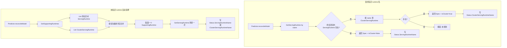

# ClusterServingRuntime 是什么

## 概述

**ClusterServingRuntime** 是 KServe 里的一种 **集群级（Cluster scope）** 自定义资源（CR），用来描述「模型服务运行时」的规格。它在语义和字段上和 **ServingRuntime** 完全一致，区别只在于：

- **ServingRuntime**：命名空间级（Namespace scope），只在指定命名空间内生效。
- **ClusterServingRuntime**：集群级（Cluster scope），在整个集群内共享，所有命名空间都可使用。

因此可以简单理解为：**ClusterServingRuntime = 集群级别的 ServingRuntime**，用于在集群内统一提供可复用的运行时模板（例如 Triton、MLServer、OVMS 等），无需在每个命名空间各建一份。

## 定义与结构

- **API 组/版本**：`serving.kserve.io/v1alpha1`
- **CRD 名称**：`clusterservingruntimes.serving.kserve.io`
- **Scope**：`Cluster`（无 `metadata.namespace`）
- **类型定义位置**：`pkg/apis/serving/v1alpha1/servingruntime_types.go`

与 ServingRuntime 共用同一套 Spec/Status：

| 字段 | 说明 |
|------|------|
| `Spec` | `ServingRuntimeSpec`：支持的模型格式、协议版本、容器列表、多模型/多节点等配置 |
| `Status` | `ServingRuntimeStatus`（当前为空结构） |

Spec 主要包含：`supportedModelFormats`、`protocolVersions`、`containers`、`multiModel`、`disabled`、`builtInAdapter` 等，与 ServingRuntime 一致。

## 在系统中的角色

- 用户或运维在集群中创建 **ClusterServingRuntime**（或命名空间内的 **ServingRuntime**）。
- 创建 **InferenceService** 时，可以通过 `spec.predictor.model.runtime` 显式指定运行时名称；若不指定，控制器会根据模型格式从可用的 ServingRuntime **和** ClusterServingRuntime 中自动选择。
- 解析到使用的是 ClusterServingRuntime 时，会在 **InferenceService 的 Status** 里写入 `clusterServingRuntimeName`，便于观测和排查。

## 解析与使用流程（调用链）

当 InferenceService 的 Predictor 需要确定「用哪个运行时」时，会先按名称解析；若未指定名称则自动选择。ClusterServingRuntime 在这两条路径中都会参与。



- **按名称解析**：先查同名 **ServingRuntime**（命名空间内），没有再查同名 **ClusterServingRuntime**（仅按 name，无 namespace）。
- **自动选择**：**GetSupportingRuntimes** 会同时列出命名空间内 ServingRuntime 和集群内 ClusterServingRuntime，过滤出支持当前模型格式/协议/多模型等条件的运行时，排序后取第一个，再通过 **GetServingRuntime** 区分是命名空间还是集群运行时，并写入对应 Status 字段。

## 关键代码位置

| 作用 | 文件路径 | 说明 |
|------|----------|------|
| 类型定义 | `pkg/apis/serving/v1alpha1/servingruntime_types.go` | `ClusterServingRuntime` 结构体及 `ServingRuntimeSpec` |
| 按名称解析 | `pkg/controller/v1beta1/inferenceservice/utils/utils.go` | `GetServingRuntime`：先 Namespace 再 Cluster |
| 自动选择列表 | `pkg/apis/serving/v1beta1/predictor_model.go` | `GetSupportingRuntimes`：List ServingRuntime + ClusterServingRuntime，排序合并 |
| 使用处与 Status 写入 | `pkg/controller/v1beta1/inferenceservice/components/predictor.go` | `reconcileModel`：调上面两个，并写 `ClusterServingRuntimeName` / `ServingRuntimeName` |
| Status 字段定义 | `pkg/apis/serving/v1beta1/inference_service_status.go` | `ClusterServingRuntimeName`、`ServingRuntimeName` |

## 调用链注释说明

调用链上的关键函数已按规范在源码首行添加 `//+模块名:步骤号 功能简述` 注释：

- `predictor.reconcileModel` → `//+predictor:1 解析或自动选择 Model 使用的 ServingRuntime/ClusterServingRuntime 并写入 Status`
- `utils.GetServingRuntime` → `//+runtime_resolver:2 按名称解析运行时：先查命名空间 ServingRuntime，再查集群 ClusterServingRuntime`
- `ModelSpec.GetSupportingRuntimes` → `//+runtime_resolver:3 列出支持当前模型格式/协议的 ServingRuntime 与 ClusterServingRuntime，排序后返回候选列表`

## 示例 YAML（概念）

```yaml
apiVersion: serving.kserve.io/v1alpha1
kind: ClusterServingRuntime
metadata:
  name: kserve-tritonserver
spec:
  supportedModelFormats:
    - name: tensorflow
      version: "2"
      autoSelect: true
      priority: 1
  protocolVersions: [v2, grpc-v2]
  containers:
    - name: kserve-container
      image: kserve-tritonserver:xxx
      # ...
```

实际示例见：`config/runtimes/kserve-tritonserver.yaml`、`config/runtimes/kserve-huggingfaceserver.yaml` 等。

## 小结

- **ClusterServingRuntime** = 集群范围的「模型服务运行时」模板，与 ServingRuntime 同 Spec，仅 scope 不同。
- 解析顺序：**先命名空间内 ServingRuntime，再集群 ClusterServingRuntime**。
- 自动选择时 **ServingRuntime 与 ClusterServingRuntime 一起参与**，按优先级排序后选第一个。
- 使用 ClusterServingRuntime 时会在 InferenceService 的 `status.clusterServingRuntimeName` 中记录名称，便于排查和观测。
