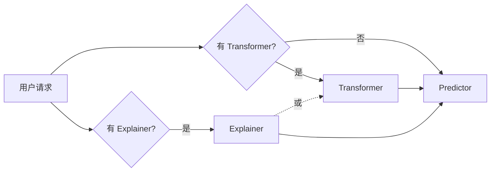
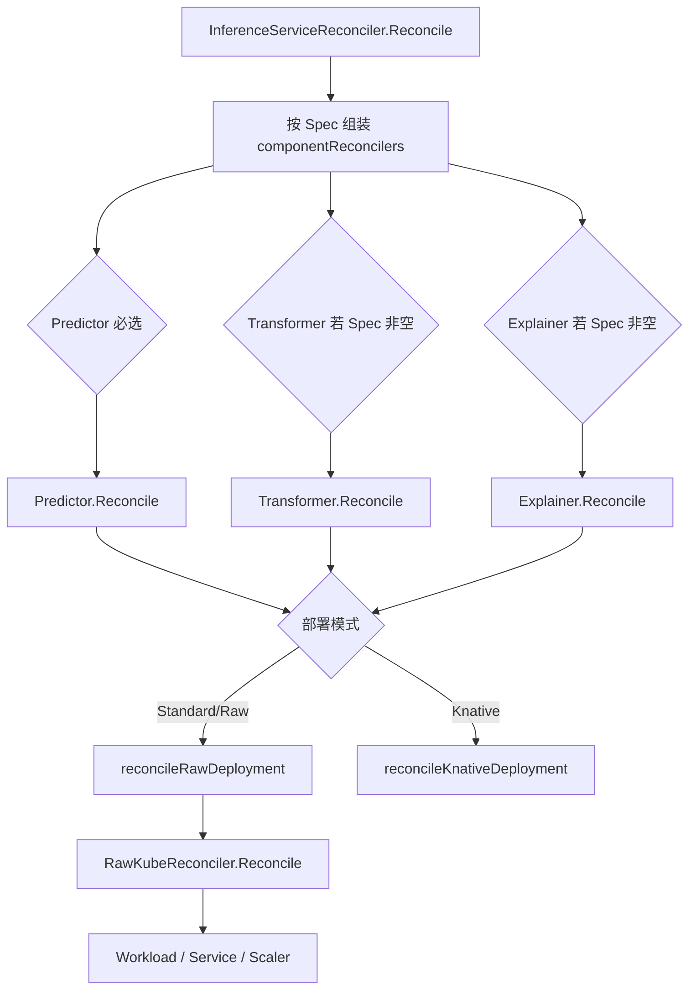

# Predictor、Transformer、Explainer 是什么

## 概述

在 KServe 中，**InferenceService** 的 Spec 下有三个与「谁来做推理、谁来做前后处理、谁来做可解释性」相关的组件：**Predictor**、**Transformer**、**Explainer**。它们分别对应三类子服务，控制器会为每个配置的组件创建独立的 Deployment/Service，并通过内部 URL 串联成请求链路。

- **Predictor**：模型推理本体，必填；加载模型并执行预测/生成。
- **Transformer**：可选；在调用 Predictor 前后做预处理与后处理，请求先到 Transformer 再转发到 Predictor。
- **Explainer**：可选；对模型预测做可解释性分析（如特征重要性），会调用 Predictor 或 Transformer。

---

## 这三个组件到底干什么、解决什么问题？

用一句话说：

| 组件 | 一句话 | 解决什么问题 |
|------|--------|--------------|
| **Predictor** | **「算答案的那一坨」**：加载训练好的模型，输入特征/样本，输出预测结果（类别、分数、生成文本等）。 | 把模型真正跑起来，对外提供推理能力。没有 Predictor 就没有推理。 |
| **Transformer** | **「把请求变成模型能吃的，再把输出变成用户要的」**：在 Predictor 前面做预处理，后面做后处理。 | 模型通常只认固定格式（如张量、特定 JSON）；用户却可能发图片、原始文本、业务 JSON。Transformer 做格式转换、裁剪、聚合等，让「用户请求 ↔ 模型」对上号。 |
| **Explainer** | **「解释模型为什么这么预测」**：在已有 Predictor（或 Transformer）之上，用可解释性算法（如 SHAP、LIME、Anchor）分析「哪些输入/特征影响了这次预测」。 | 业务需要可解释性（合规、审计、调试）：为什么拒贷？为什么判成某类？Explainer 专门提供解释接口。 |

### 什么时候只用 Predictor？

- 请求格式已经和模型输入一致（例如客户端直接发模型要的 JSON 或张量），且不需要「解释这次预测」。
- 典型：内部服务调用、已有网关做了格式转换、简单分类/回归 API。

### 什么时候加 Transformer？

- 用户发的是**原始数据**（图片、文本、复杂 JSON），模型要的是**另一种格式**（张量、id 序列、固定 schema）。
- 例如：用户上传图片 → 需要解码、resize、归一化 → 再送给图像分类 Predictor；或用户发业务 JSON → 需要抽特征、编码 → 再送给 sklearn Predictor。
- 把「前后处理」单独做成 Transformer，可以和 Predictor 独立扩缩容、升级。

### 什么时候加 Explainer？

- 业务或合规要求**解释预测**：为什么拒绝、为什么判成 A 不是 B、哪些特征最重要。
- 例如：贷款模型不仅要返回「通过/拒绝」，还要返回「主要因为收入/负债/年龄」；图像分类要返回「主要因为哪些区域」。
- Explainer 会调用 Predictor（有时经过 Transformer）拿到预测，再用解释算法（ART、Alibi 等）算特征重要性或反事实，单独暴露解释 API。

---

## 定义与是否必填

| 组件 | 含义 | 是否必填 | 调用关系 |
|------|------|----------|----------|
| **Predictor** | 模型推理 | **必填** | 被 Transformer、Explainer 调用；不依赖其他组件。 |
| **Transformer** | 前后处理 | 可选 | **调用 Predictor**。 |
| **Explainer** | 可解释性 | 可选 | **调用 Predictor 或 Transformer**（若存在）。 |

API 定义位于 `pkg/apis/serving/v1beta1/inference_service.go`：

```go
type InferenceServiceSpec struct {
	Predictor   PredictorSpec    `json:"predictor"`             // +required
	Explainer   *ExplainerSpec   `json:"explainer,omitempty"`   // optional
	Transformer *TransformerSpec `json:"transformer,omitempty"`  // optional
}
```

## 请求流向

- **普通预测**：用户 →（若配置）Transformer → Predictor。
- **解释请求**：用户 → Explainer → Predictor 或 Transformer。



## 控制器中的调和流程（调用链）

从 InferenceService 的调和入口到「为每个组件创建资源」的调用链如下（≥3 步，分支为 Predictor / Transformer / Explainer）：



### 关键代码位置

| 步骤 | 函数 | 文件路径 |
|------|------|----------|
| 1 | `InferenceServiceReconciler.Reconcile` | `pkg/controller/v1beta1/inferenceservice/controller.go` |
| 2 | `Predictor.Reconcile` | `pkg/controller/v1beta1/inferenceservice/components/predictor.go` |
| 2b | `Transformer.Reconcile` | `pkg/controller/v1beta1/inferenceservice/components/transformer.go` |
| 2c | `Explainer.Reconcile` | `pkg/controller/v1beta1/inferenceservice/components/explainer.go` |
| 3 | `Predictor.reconcileRawDeployment` | `pkg/controller/v1beta1/inferenceservice/components/predictor.go` |
| 4 | `RawKubeReconciler.Reconcile` | `pkg/controller/v1beta1/inferenceservice/reconcilers/raw/raw_kube_reconciler.go` |

组件列表在 controller 中按 Spec 动态组装（Predictor 非 ModelMesh 时必有；Transformer/Explainer 仅在 `isvc.Spec.Transformer != nil` / `isvc.Spec.Explainer != nil` 时加入），然后对每个 component 调用 `reconciler.Reconcile(ctx, isvc)`。

## 示例一：只有 Predictor（直接推理）

**场景**：客户端已经按模型约定发 JSON（例如特征向量），不需要图片解码、特征工程，也不需要解释。

**YAML**：

```yaml
apiVersion: serving.kserve.io/v1beta1
kind: InferenceService
metadata:
  name: my-model
  namespace: default
spec:
  predictor:
    model:
      modelFormat: { name: sklearn }
      storageUri: "s3://bucket/model"
```

**请求流**：用户 → Predictor（唯一服务）→ 返回预测结果。

**控制器行为**：只创建 Predictor 的 Deployment/Service；请求直接打到 `my-model-predictor`。

---

## 示例二：Predictor + Transformer（图像分类：先预处理再推理）

**场景**：用户上传**原始图片**，模型是 PyTorch 图像分类器，只接受张量。需要有人先做「解码图片 → resize → 归一化 → 张量」，再送给 Predictor。

**YAML**（来自 `docs/samples/v1beta1/transformer/torchserve_image_transformer/transformer.yaml`）：

```yaml
apiVersion: serving.kserve.io/v1beta1
kind: InferenceService
metadata:
  name: torch-transformer
spec:
  transformer:
    containers:
      - image: kserve/image-transformer:latest
        name: kserve-container
  predictor:
    pytorch:
      storageUri: gs://kfserving-examples/models/torchserve/image_classifier/v1
```

**请求流**：用户发图片 → **Transformer**（解码、resize、转张量）→ **Predictor**（跑模型）→ Transformer 拿到预测后再整理成业务 JSON → 返回用户。

**作用**：Transformer 负责「用户格式 ↔ 模型格式」；Predictor 只关心推理。这样前后处理与推理可以分开扩缩容、升级。

---

## 示例三：Predictor + Explainer（收入模型：预测 + 解释）

**场景**：收入/贷款类模型，不仅要返回「是否通过」，还要解释「主要因为哪些特征（收入、学历、年龄等）」。

**YAML**（来自 `docs/samples/explanation/alibi/income/income.yaml`）：

```yaml
apiVersion: serving.kserve.io/v1beta1
kind: InferenceService
metadata:
  name: income
spec:
  predictor:
    sklearn:
      storageUri: "gs://seldon-models/sklearn/income/model"
  explainer:
    alibi:
      type: AnchorTabular
      storageUri: "gs://kfserving-examples/models/sklearn/1.3/income/explainer"
```

**请求流**：

- **预测**：用户 → Predictor → 返回通过/拒绝。
- **解释**：用户调 Explainer 的接口（带同一批输入）→ **Explainer** 内部会调 Predictor 拿到预测，再用 Alibi 的 Anchor 算法算特征重要性 → 返回「因为收入 < x、学历 = y … 所以拒绝」。

**作用**：Explainer 专门提供「为什么这么预测」的 API，满足合规、审计或产品展示需求。

---

## 示例四：Predictor + Explainer（MNIST + ART 对抗解释）

**场景**：分类模型不仅要预测类别，还要用可解释性框架（如 ART）做对抗样本或特征重要性。

**YAML**（来自 `docs/samples/explanation/art/mnist/art.yaml`）：

```yaml
apiVersion: serving.kserve.io/v1beta1
kind: InferenceService
metadata:
  name: artserver
spec:
  predictor:
    model:
      modelFormat: { name: sklearn }
      storageUri: gs://kfserving-examples/models/sklearn/mnist/art
  explainer:
    art:
      type: SquareAttack
      config:
        nb_classes: "10"
```

**请求流**：预测走 Predictor；解释请求走 Explainer，Explainer 内部调 Predictor 并用 ART（如 SquareAttack）生成解释结果。

---

## 示例五：Predictor + Transformer 同 Pod（Collocation）

**场景**：希望 Transformer 和 Predictor 放在**同一个 Pod** 里（少一跳网络、延迟更小），而不是两个独立 Deployment。

**YAML**（来自 `docs/samples/v1beta1/transformer/collocation/collocation.yaml`）：

```yaml
apiVersion: serving.kserve.io/v1beta1
kind: InferenceService
metadata:
  name: custom-transformer-collocation
spec:
  predictor:
    containers:
      - name: kserve-container
        image: "pytorch/torchserve:0.9.0-cpu"
        # ... predictor 容器
      - name: transformer-container
        image: kserve/image-transformer:latest
        # ... transformer 容器， predictor_host=localhost:8085
```

**与示例二区别**：这里没有单独的 `spec.transformer` 段，而是把 transformer 作为 predictor 的**第二个容器**放在同一个 Pod。请求仍可先到 transformer 容器再转给 predictor 容器，但只会有**一个** Deployment（Predictor 的），不会多出一个 Transformer 的 Deployment。适合对延迟敏感、流量同机即可的场景。

---

## 示例小结与「何时用谁」

| 需求 | 用到的组件 | 对应示例 |
|------|------------|----------|
| 只做推理，请求格式已对齐模型 | 仅 Predictor | 示例一 |
| 用户发原始数据（图/文本），模型要另一种格式 | Predictor + Transformer | 示例二 |
| 要解释「为什么这么预测」 | Predictor + Explainer | 示例三、四 |
| 要预处理 + 推理且希望同机低延迟 | Predictor 双容器（collocation） | 示例五 |

控制器对「仅 Predictor」「Predictor+Transformer」「Predictor+Explainer」的调和流程一致：根据 Spec 组装 `componentReconcilers`（Predictor 必选；Transformer/Explainer 若 Spec 非空则加入），对每个组件调用 `Reconcile`，再按部署模式走 Raw 或 Knative，生成对应 Deployment/Service。

## 延伸

- **Spec 与类型**：`PredictorSpec`、`TransformerSpec`、`ExplainerSpec` 分别在 `pkg/apis/serving/v1beta1/` 下各组件同名文件中定义（如 `predictor.go`、`transformer.go`、`explainer.go`）。
- **路由**：Ingress/HTTPRoute 的调和在 controller 中于组件调和之后进行，见 `reconcilers/ingress`（如 `reconcilePredictorHTTPRoute`、`reconcileTransformerHTTPRoute`、`reconcileExplainerHTTPRoute`）。
- **部署模式**：除 Standard（Raw Deployment）外，还有 Knative、ModelMesh 等，决定组件是走 `reconcileRawDeployment` 还是 `reconcileKnativeDeployment`；ModelMesh 时 Predictor 不由此控制器创建。
- **更多示例 YAML**：仓库内 `docs/samples/` 下有大量示例，例如：
  - `v1beta1/transformer/`：各种 Transformer（图像、Feast 等）；
  - `explanation/`：ART、Alibi、AIX、AIF 等 Explainer 示例。

更多可参考 [ServingRuntime_and_ClusterServingRuntime.md](ServingRuntime_and_ClusterServingRuntime.md)、[ClusterServingRuntime.md](ClusterServingRuntime.md)。
