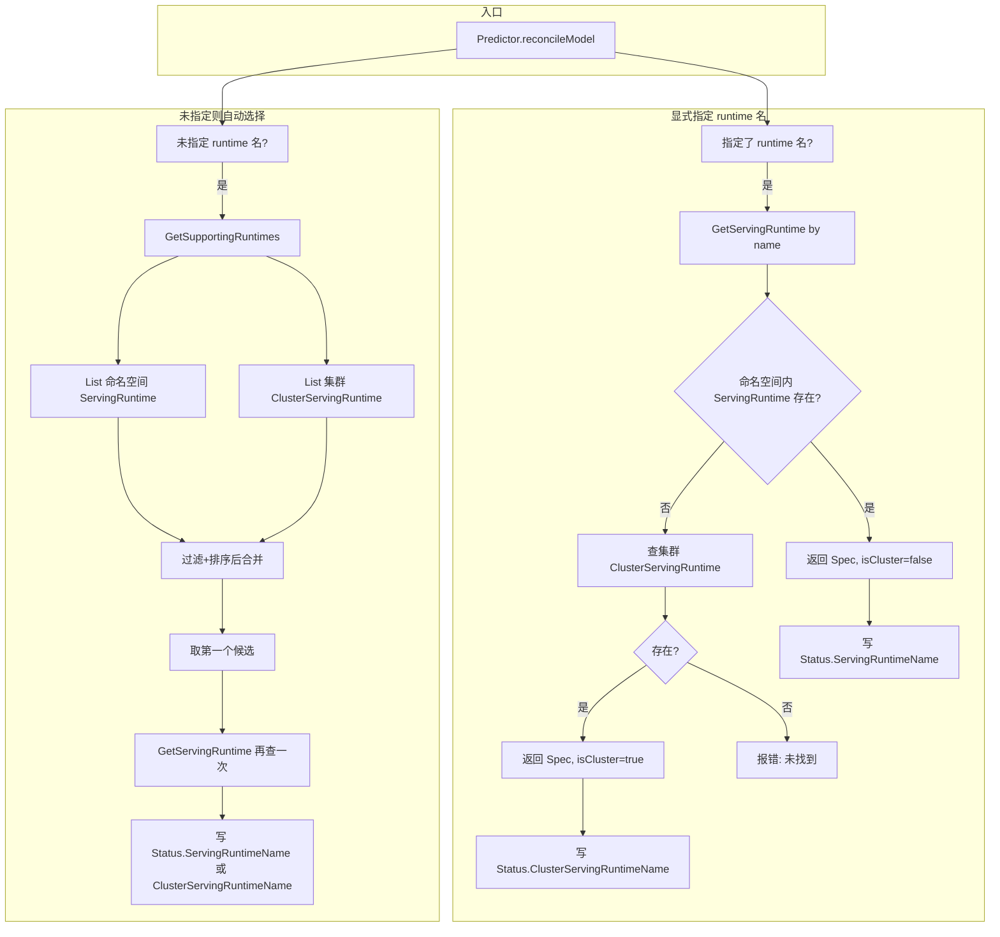
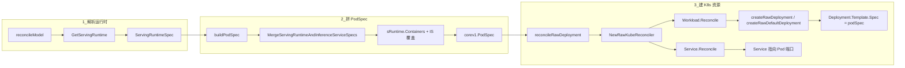

# ServingRuntime 和 ClusterServingRuntime 是什么？它们的作用是什么？

## 概述

**ServingRuntime** 和 **ClusterServingRuntime** 是 KServe 中用来描述「模型服务运行时」的两种自定义资源（CR）。二者 **Spec 完全一致**，都使用 `ServingRuntimeSpec`，唯一区别是 **作用范围（Scope）**：

| 资源 | 作用范围 | 典型用途 |
|------|----------|----------|
| **ServingRuntime** | 命名空间级（Namespace） | 仅在当前命名空间内可用，适合租户隔离、命名空间专属运行时 |
| **ClusterServingRuntime** | 集群级（Cluster） | 集群内所有命名空间共享，适合平台统一提供的通用运行时（如 Triton、MLServer） |

可以简单记：**ClusterServingRuntime = 集群级别的 ServingRuntime**，同一套 Spec、两种作用域。

## 它们是什么（定义）

- **API 组/版本**：`serving.kserve.io/v1alpha1`
- **CRD**：
  - ServingRuntime：`servingruntimes.serving.kserve.io`，scope 为 Namespace
  - ClusterServingRuntime：`clusterservingruntimes.serving.kserve.io`，scope 为 Cluster
- **类型定义**：`pkg/apis/serving/v1alpha1/servingruntime_types.go`
  - `ServingRuntime` / `ServingRuntimeList`
  - `ClusterServingRuntime` / `ClusterServingRuntimeList`
  - 共用 `ServingRuntimeSpec`、`ServingRuntimeStatus`

**Spec 主要字段**（二者相同）：

| 字段 | 说明 |
|------|------|
| `supportedModelFormats` | 支持的模型格式及版本（如 tensorflow、pytorch、onnx）、是否参与自动选择、优先级 |
| `protocolVersions` | 支持的推理协议（v1/v2、grpc-v1/grpc-v2） |
| `containers` | 运行时容器（镜像、启动参数等） |
| `multiModel` | 是否多模型服务（ModelMesh 场景） |
| `disabled` | 是否禁用该运行时 |
| `builtInAdapter` | 内置适配器（Triton/MLServer/OVMS 等）配置 |
| `workerSpec` | 多节点/多 GPU 配置 |

## 它们的作用是什么

1. **定义「用什么环境跑模型」**  
   指定容器镜像、端口、支持的模型格式与协议，供 InferenceService 的 Predictor 使用。控制器会根据这些信息生成 Deployment、Service 等资源。

2. **被 InferenceService 引用**  
   - 用户可在 `InferenceService.spec.predictor.model.runtime` 中**显式指定**运行时名称（先查同命名空间 ServingRuntime，再查集群 ClusterServingRuntime）。
   - 若不指定，控制器会从当前命名空间的 ServingRuntime **和** 集群的 ClusterServingRuntime 中，按模型格式、协议、优先级**自动选择**一个运行时。

3. **在 Status 中区分来源**  
   - 若最终用的是 **ServingRuntime**，则 `InferenceService.status.servingRuntimeName` 被设置。
   - 若用的是 **ClusterServingRuntime**，则 `InferenceService.status.clusterServingRuntimeName` 被设置。  
   便于运维和排查「当前推理服务用的是哪个运行时」。

4. **集群级 vs 命名空间级**  
   - **ClusterServingRuntime**：一次定义、全集群复用，适合平台预置的 Triton、MLServer、OVMS 等。
   - **ServingRuntime**：按命名空间隔离，适合多租户或某命名空间专用运行时。

## 解析与选择流程（调用链）

控制器在调和 InferenceService 的 Predictor 时，会确定「用哪个运行时」：要么按名称解析，要么自动选择。两种资源都参与该流程。



- **按名称解析**：先查同名 **ServingRuntime**（当前命名空间），没有再查同名 **ClusterServingRuntime**（集群，无 namespace）。
- **自动选择**：**GetSupportingRuntimes** 同时列出命名空间内 ServingRuntime 与集群 ClusterServingRuntime，按支持格式、协议、优先级排序后取第一个，再通过 **GetServingRuntime** 区分来源并写入对应 Status 字段。

## 关键代码位置

| 作用 | 文件路径 |
|------|----------|
| 类型与 Spec 定义 | `pkg/apis/serving/v1alpha1/servingruntime_types.go` |
| 按名称解析（先 SR 再 CSR） | `pkg/controller/v1beta1/inferenceservice/utils/utils.go`：`GetServingRuntime` |
| 自动选择列表（SR + CSR） | `pkg/apis/serving/v1beta1/predictor_model.go`：`GetSupportingRuntimes` |
| 使用处与 Status 写入 | `pkg/controller/v1beta1/inferenceservice/components/predictor.go`：`reconcileModel` |
| Status 字段定义 | `pkg/apis/serving/v1beta1/inference_service_status.go`：`ServingRuntimeName`、`ClusterServingRuntimeName` |

上述调用链上的关键函数已在源码中按 `//+模块名:步骤号 功能简述` 规范添加首行注释，便于阅读。

## 从 Runtime 到 Deployment/Service：源码与示例

控制器确实会**根据 ServingRuntime/ClusterServingRuntime 的 Spec（容器镜像、端口、模型格式与协议等）生成 Deployment、Service 等资源**。下面用源码位置 + 一个具体示例说明整条流程，便于理解。

### 源码流程（谁在用 Runtime 的容器/端口）

整体链路：**解析 Runtime → 用 Runtime 的 containers 拼 PodSpec → 用 PodSpec 建 Deployment/Service**。



- **步骤 1（解析运行时）**  
  `Predictor.Reconcile` 里若 `isvc.Spec.Predictor.Model != nil`，会先调 `reconcileModel` → `GetServingRuntime`，得到 `ServingRuntimeSpec`（其中包含 `containers`、`supportedModelFormats`、`protocolVersions` 等）。

- **步骤 2（用 Runtime 拼 PodSpec）**  
  `buildPodSpec(isvc, sRuntime)` 会用 **Runtime 的 `containers`** 与 InferenceService 的覆盖做合并：
  - 调用 `MergeServingRuntimeAndInferenceServiceSpecs(sRuntime.Containers, isvc.Spec.Predictor.Model.Container, ...)`（`predictor.go` 约 385 行），得到合并后的主容器与 `mergedPodSpec`。
  - Runtime 里配置的**镜像、args、端口、resources** 等都会进这个 PodSpec；若有 transformer 或其它容器，也会从 `sRuntime.Containers` 一并追加。
  - 代码位置：`pkg/controller/v1beta1/inferenceservice/components/predictor.go` 的 `buildPodSpec`。

- **步骤 3（用 PodSpec 建 Deployment/Service）**  
  - `reconcileRawDeployment` 用上面得到的 `podSpec` 创建 `RawKubeReconciler`，再调用 `r.Reconcile(ctx)`。
  - `RawKubeReconciler.Reconcile` 依次调 `Workload.Reconcile`、`Service.Reconcile`、`Scaler.Reconcile`。
  - **Deployment**：`reconcilers/deployment` 里的 `createRawDeployment` → `createRawDefaultDeployment(..., podSpec, ...)` 会把 **PodSpec 填进 Deployment 的 Pod 模板**（`deployment.Template.Spec = *podSpec`），再 `client.Create` 或 `Patch` 到集群。
  - **Service**：由 `reconcilers/service` 根据同一套 `ComponentMeta`/`PodSpec` 创建，指向这些 Pod 的端口（如 8080/9000 等）。
  - 代码位置：  
    - `predictor.go`：`reconcileRawDeployment`；  
    - `reconcilers/raw/raw_kube_reconciler.go`：`Reconcile`；  
    - `reconcilers/deployment/deployment_reconciler.go`：`createRawDeployment`、`createRawDefaultDeployment`、`Reconcile`。

### 示例：一个 ClusterServingRuntime + 一个 InferenceService 会怎样变成 Deployment/Service

下面用**一个最小示例**把「Runtime 里的镜像、端口」和「最终 Deployment/Service」对应起来，方便理解整条流程。

**1. 集群里有一个 ClusterServingRuntime（例如 Triton）**

例如 `config/runtimes/kserve-tritonserver.yaml` 里的一段：

```yaml
apiVersion: serving.kserve.io/v1alpha1
kind: ClusterServingRuntime
metadata:
  name: kserve-tritonserver
spec:
  supportedModelFormats:
    - name: tensorflow
      version: "2"
      autoSelect: true
      priority: 1
  protocolVersions: [v2, grpc-v2]
  containers:
    - name: kserve-container
      image: kserve-tritonserver:replace
      args:
        - tritonserver
        - --model-store=/mnt/models
        - --grpc-port=9000
        - --http-port=8080
```

这里就定义了**容器镜像、启动参数、以及推理端口（如 8080 HTTP、9000 gRPC）**。

**2. 用户创建一个引用该 Runtime 的 InferenceService**

```yaml
apiVersion: serving.kserve.io/v1beta1
kind: InferenceService
metadata:
  name: my-tf-svc
  namespace: default
spec:
  predictor:
    model:
      modelFormat: { name: tensorflow, version: "2" }
      runtime: kserve-tritonserver   # 显式指定用上面的 ClusterServingRuntime
      storageUri: "s3://bucket/model"
```

**3. 控制器里实际发生了什么（对应上面源码）**

1. **解析运行时**  
   `reconcileModel` → `GetServingRuntime(ctx, client, "kserve-tritonserver", "default")`：先查命名空间里有没有名为 `kserve-tritonserver` 的 ServingRuntime，没有则查集群里的 ClusterServingRuntime，命中后得到其 `ServingRuntimeSpec`（含上面的 `containers`）。
2. **拼 PodSpec**  
   `buildPodSpec(isvc, sRuntime)` 会：
   - 用 `sRuntime.Containers`（即上面的 `kserve-container`：镜像、args、端口等）与 InferenceService 的 `predictor.model.container`（若有）做合并；
   - 再加上 Storage Initializer 等，得到最终的 `corev1.PodSpec`（Pod 里跑的正是 Triton 的镜像和参数）。
3. **建 Deployment / Service**  
   `reconcileRawDeployment` 用这个 `podSpec` 建 `RawKubeReconciler` 并 `Reconcile`：
   - **Deployment**：`createRawDefaultDeployment(..., podSpec, ...)` 会生成一个 Deployment，其 `spec.template.spec` = 上述 PodSpec，即 Pod 里是 Triton 容器（镜像、8080/9000 端口等来自 Runtime）。
   - **Service**：根据同一组件元数据和 Pod 端口创建 Service，把流量引到这些 Pod。

**4. 最终构建出的资源示例（控制器实际写进集群的 YAML 形态）**

在 Standard 部署模式下，上面示例中的 `my-tf-svc` 会得到类似下面的 Deployment 和 Service（名称来自 `InferenceService.name` + `-predictor`，Pod 由 Runtime 的容器 + 可选 Storage Initializer 等组成）。此处仅展示与 Runtime 直接相关的核心结构，省略 HPA、Ingress 等。

```yaml
# --- Deployment（名称：<InferenceService名>-predictor）---
apiVersion: apps/v1
kind: Deployment
metadata:
  name: my-tf-svc-predictor
  namespace: default
  labels:
    app: isvc.my-tf-svc-predictor
    component: predictor
spec:
  selector:
    matchLabels:
      app: isvc.my-tf-svc-predictor
  template:
    metadata:
      labels:
        app: isvc.my-tf-svc-predictor
        component: predictor
    spec:
      # 以下 Pod 内容来自 ClusterServingRuntime 的 containers + InferenceService 合并
      containers:
        - name: kserve-container
          image: kserve-tritonserver:replace
          args:
            - tritonserver
            - --model-store=/mnt/models
            - --grpc-port=9000
            - --http-port=8080
          ports:
            - containerPort: 8080
            - containerPort: 9000
          # resources、volumeMounts 等可来自 Runtime 或 IS 覆盖
        # 若有 storageUri，还会有一个 storage-initializer initContainer
---
# --- Service（名称：<InferenceService名>-predictor）---
apiVersion: v1
kind: Service
metadata:
  name: my-tf-svc-predictor
  namespace: default
spec:
  selector:
    app: isvc.my-tf-svc-predictor
  ports:
    - name: http
      port: 80
      targetPort: 8080
    - name: grpc
      port: 9000
      targetPort: 9000
```

因此，**Runtime 里指定的容器镜像、端口、支持的模型格式与协议，会通过这条链路进入 PodSpec，再被用来生成上述形态的 Deployment 和 Service**；对应源码就是上面列出的 `buildPodSpec`、`reconcileRawDeployment`、`createRawDeployment`/`createRawDefaultDeployment` 以及 `RawKubeReconciler.Reconcile`。

---

## 从机器学习角度：为什么需要 Runtime？与 vLLM 的关系

### 为什么需要 Runtime（ServingRuntime / ClusterServingRuntime）

从机器学习推理链路来看，一次「模型服务」需要同时确定三件事：

1. **模型格式**：模型怎么存、怎么加载（如 TensorFlow SavedModel、PyTorch TorchScript、ONNX、HuggingFace 目录等）。
2. **推理框架/引擎**：谁负责加载模型、跑推理、暴露 HTTP/gRPC 接口（如 Triton、MLServer、vLLM、TorchServe 等）。
3. **协议与端口**：对外提供哪种 API（KServe v1/v2、gRPC、OpenAI 兼容等）以及监听哪些端口。

**Runtime 在 KServe 里就是「推理框架 + 模型格式 + 协议」的模板**：  
它声明「我这个运行时用哪个镜像、跑哪个推理引擎、支持哪些模型格式和协议」。InferenceService 只关心「要服务哪个模型、从哪里拉模型」；**用哪个引擎、用什么端口和协议**，则由 Runtime 提供。这样：

- 平台可以预置若干 Runtime（Triton、MLServer、HuggingFace Server 等），用户按模型格式选一个即可；
- 同一套 Runtime 可被多个 InferenceService 复用，无需每个服务都写死镜像和启动参数。

所以 **Runtime 不是「推理框架本身」**，而是 **「对某个推理框架（及其镜像、参数、支持的格式与协议）的 K8s 抽象」**。vLLM、Triton、MLServer 等是具体的推理框架；Runtime 是「在 KServe 里如何配置、选用这些框架」的 CR。

### Runtime 和 vLLM 的关系：有「vLLM Runtime」吗？

- **vLLM** 本身是一个**推理框架/引擎**（类似 Triton、MLServer），专注 LLM 高吞吐推理，提供 HTTP/OpenAI 兼容 API 等。
- 在 KServe 里，**没有单独一个叫 "ServingRuntime: vllm" 的 CR**，但**有使用 vLLM 的运行时**，常见两种形态：
  1. **HuggingFace Server + vLLM 后端**：`ClusterServingRuntime` 使用 `kserve/huggingfaceserver` 等镜像，通过环境或配置启用 vLLM 后端（例如 `serving.kserve.io/server-type: huggingfaceserver`，镜像内用 vLLM 做推理）。E2E 和安装脚本里都有 `vllm` 相关用例（如 `test/e2e/predictor/test_huggingface_vllm_cpu.py`、install 脚本里的 vLLM 环境变量与 `vllm serve` 命令）。
  2. **LLM InferenceService（LLMInferenceService）**：KServe 的 v1alpha2 **LLMInferenceService** 控制器会为 LLM 场景生成使用 **vLLM** 的 workload（例如 `vllm serve /mnt/models ...`），配置在 `charts/kserve-runtime-configs/files/llmisvcconfigs/resources.yaml`、install 脚本内嵌的 ClusterServingRuntime/预设里，包含 `VLLM_*` 环境变量和 `vllm serve` 启动命令。

因此可以简单记：**Runtime = 在 KServe 里选用「用谁做推理」的模板**；Triton、MLServer、vLLM 等是具体引擎；**有基于 vLLM 的 Runtime/预设**（通过 HuggingFace Runtime 的 vLLM 后端或 LLMInferenceService 的 vLLM 配置），但没有一个 CR kind 专门叫 "VLLMRuntime"。

### HuggingFace Server 与 vLLM 后端的关系

**HuggingFace Server** 指的是 KServe 的 `kserve/huggingfaceserver` 这类镜像里跑的一个**统一推理服务进程**：对外暴露 KServe/OpenAI 兼容的 HTTP API（如 `/v1/models/.../predict`、`/openai/v1/chat/completions`），请求进来后由它**内部选一个「后端」**去真正加载模型、做推理。

- **两种后端**（代码里见 `python/huggingfaceserver/huggingfaceserver/__init__.py` 的 `Backend` 枚举）：
  - **`huggingface`**：用 HuggingFace 生态（transformers、accelerate 等）做推理，适合小模型、encoder、非 LLM 生成等。
  - **`vllm`**：把实际推理交给 **vLLM 引擎**（高吞吐、PagedAttention 等），适合大语言模型生成。
- **选择方式**：启动参数 `--backend=huggingface` / `--backend=vllm`，或 **`auto`**（默认）：若模型在 vLLM 支持列表里则用 vLLM，否则退回 HuggingFace 后端（见 `python/huggingfaceserver/huggingfaceserver/__main__.py` 中 `is_vllm_backend_enabled`、`VLLMModel` 的加载逻辑）。
- **关系一句话**：**HuggingFace Server = 一个对外提供 API 的服务进程；vLLM 后端 = 该进程内部可选的推理引擎之一**。不是两个独立服务，而是「一个服务，两种推理实现可切换」。

---

## Predictor、Transformer、Explainer 是什么？（代码里的三组件）

在 **InferenceService** 的 Spec 里（`pkg/apis/serving/v1beta1/inference_service.go`），有三个可选组件，对应三类子服务：

| 组件 | 含义 | 是否必填 | 调用关系 |
|------|------|----------|----------|
| **Predictor** | **模型推理**：加载模型、执行预测/生成，是核心推理能力。 | **必填** | 被 Transformer、Explainer 调用；不依赖其他组件。 |
| **Transformer** | **前后处理**：在调用 Predictor 前后做预处理（如分词、特征转换）与后处理（如解析、格式化）。 | 可选 | **调用 Predictor**；请求先到 Transformer，再转发到 Predictor，最后把结果返回或再加工。 |
| **Explainer** | **可解释性**：对模型预测做解释（如特征重要性、反事实等），通常依赖 ART 等解释框架。 | 可选 | **调用 Predictor 或 Transformer**（若存在）；解释请求会转发到下游推理服务。 |

- **代码定义**：
  - `Predictor`：`PredictorSpec`，必填；可包含 `Model`（ServingRuntime/ClusterServingRuntime）、或各类框架（TFServing、SKLearn、XGBoost 等）。
  - `Transformer`：`TransformerSpec`（`pkg/apis/serving/v1beta1/transformer.go`），注释写明：「pre/post processing before and after the predictor call，transformer service calls to predictor service」。
  - `Explainer`：`ExplainerSpec`（`pkg/apis/serving/v1beta1/explainer.go`），注释写明：「model explanation service spec，explainer service calls to predictor or transformer if it is specified」。
- **请求流向**：  
  **用户 → (可选) Transformer → Predictor**；若配了 Explainer，**用户 → Explainer → Predictor 或 Transformer**。  
  控制器会为每个组件分别建 Deployment/Service（例如 `my-svc-predictor`、`my-svc-transformer`），通过内部 URL 串联。

因此：**Predictor = 推理本体；Transformer = 前后处理并调 Predictor；Explainer = 可解释性并调 Predictor/Transformer**。

## 小结

- **是什么**：ServingRuntime 与 ClusterServingRuntime 是同一套「模型服务运行时」规格的两种 CR，Spec 一致，区别仅为 **Namespace 级** vs **Cluster 级**。
- **作用**：定义推理运行时（容器、模型格式、协议等）；被 InferenceService 显式或自动引用；通过 Status 区分当前使用的是命名空间运行时还是集群运行时，便于复用与排查。

更多细节可参考：[ClusterServingRuntime.md](ClusterServingRuntime.md)。
