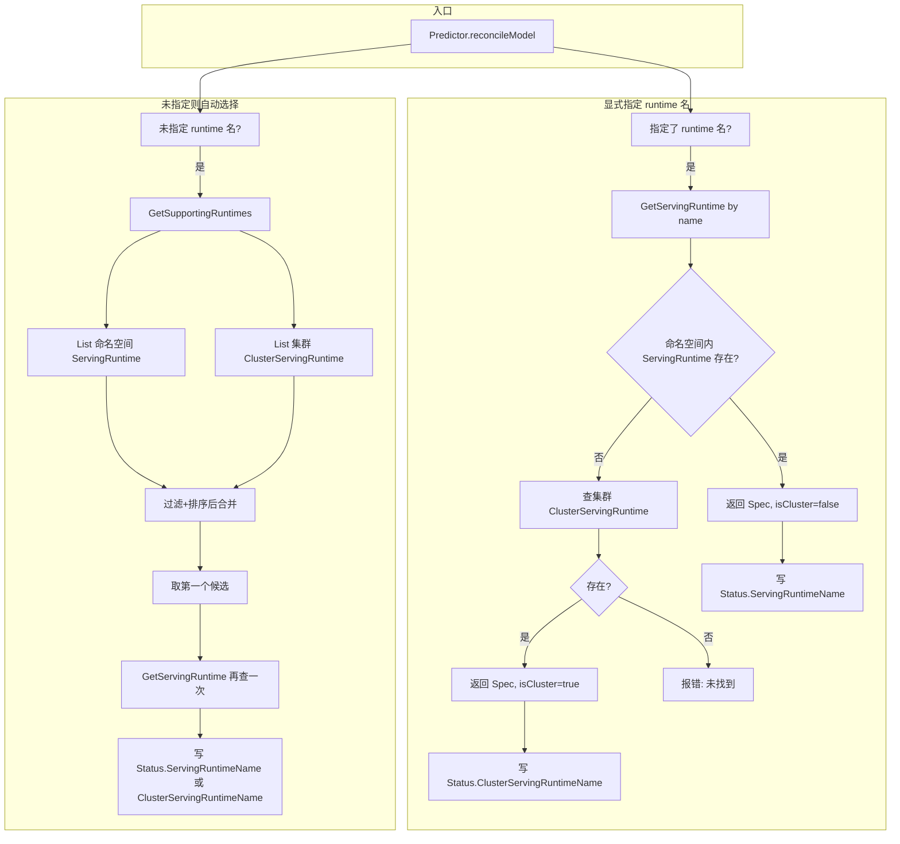
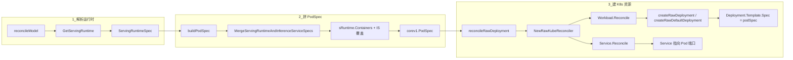

# ServingRuntime 和 ClusterServingRuntime 是什么？它们的作用是什么？

## 概述

**ServingRuntime** 和 **ClusterServingRuntime** 是 KServe 中用来描述「模型服务运行时」的两种自定义资源（CR）。二者 **Spec 完全一致**，都使用 `ServingRuntimeSpec`，唯一区别是 **作用范围（Scope）**：

| 资源 | 作用范围 | 典型用途 |
|------|----------|----------|
| **ServingRuntime** | 命名空间级（Namespace） | 仅在当前命名空间内可用，适合租户隔离、命名空间专属运行时 |
| **ClusterServingRuntime** | 集群级（Cluster） | 集群内所有命名空间共享，适合平台统一提供的通用运行时（如 Triton、MLServer） |

可以简单记：**ClusterServingRuntime = 集群级别的 ServingRuntime**，同一套 Spec、两种作用域。

## 它们是什么（定义）

- **API 组/版本**：`serving.kserve.io/v1alpha1`
- **CRD**：
  - ServingRuntime：`servingruntimes.serving.kserve.io`，scope 为 Namespace
  - ClusterServingRuntime：`clusterservingruntimes.serving.kserve.io`，scope 为 Cluster
- **类型定义**：`pkg/apis/serving/v1alpha1/servingruntime_types.go`
  - `ServingRuntime` / `ServingRuntimeList`
  - `ClusterServingRuntime` / `ClusterServingRuntimeList`
  - 共用 `ServingRuntimeSpec`、`ServingRuntimeStatus`

**Spec 主要字段**（二者相同）：

| 字段 | 说明 |
|------|------|
| `supportedModelFormats` | 支持的模型格式及版本（如 tensorflow、pytorch、onnx）、是否参与自动选择、优先级 |
| `protocolVersions` | 支持的推理协议（v1/v2、grpc-v1/grpc-v2） |
| `containers` | 运行时容器（镜像、启动参数等） |
| `multiModel` | 是否多模型服务（ModelMesh 场景） |
| `disabled` | 是否禁用该运行时 |
| `builtInAdapter` | 内置适配器（Triton/MLServer/OVMS 等）配置 |
| `workerSpec` | 多节点/多 GPU 配置 |

## 它们的作用是什么

1. **定义「用什么环境跑模型」**  
   指定容器镜像、端口、支持的模型格式与协议，供 InferenceService 的 Predictor 使用。控制器会根据这些信息生成 Deployment、Service 等资源。

2. **被 InferenceService 引用**  
   - 用户可在 `InferenceService.spec.predictor.model.runtime` 中**显式指定**运行时名称（先查同命名空间 ServingRuntime，再查集群 ClusterServingRuntime）。
   - 若不指定，控制器会从当前命名空间的 ServingRuntime **和** 集群的 ClusterServingRuntime 中，按模型格式、协议、优先级**自动选择**一个运行时。

3. **在 Status 中区分来源**  
   - 若最终用的是 **ServingRuntime**，则 `InferenceService.status.servingRuntimeName` 被设置。
   - 若用的是 **ClusterServingRuntime**，则 `InferenceService.status.clusterServingRuntimeName` 被设置。  
   便于运维和排查「当前推理服务用的是哪个运行时」。

4. **集群级 vs 命名空间级**  
   - **ClusterServingRuntime**：一次定义、全集群复用，适合平台预置的 Triton、MLServer、OVMS 等。
   - **ServingRuntime**：按命名空间隔离，适合多租户或某命名空间专用运行时。

## 解析与选择流程（调用链）

控制器在调和 InferenceService 的 Predictor 时，会确定「用哪个运行时」：要么按名称解析，要么自动选择。两种资源都参与该流程。



- **按名称解析**：先查同名 **ServingRuntime**（当前命名空间），没有再查同名 **ClusterServingRuntime**（集群，无 namespace）。
- **自动选择**：**GetSupportingRuntimes** 同时列出命名空间内 ServingRuntime 与集群 ClusterServingRuntime，按支持格式、协议、优先级排序后取第一个，再通过 **GetServingRuntime** 区分来源并写入对应 Status 字段。

## 关键代码位置

| 作用 | 文件路径 |
|------|----------|
| 类型与 Spec 定义 | `pkg/apis/serving/v1alpha1/servingruntime_types.go` |
| 按名称解析（先 SR 再 CSR） | `pkg/controller/v1beta1/inferenceservice/utils/utils.go`：`GetServingRuntime` |
| 自动选择列表（SR + CSR） | `pkg/apis/serving/v1beta1/predictor_model.go`：`GetSupportingRuntimes` |
| 使用处与 Status 写入 | `pkg/controller/v1beta1/inferenceservice/components/predictor.go`：`reconcileModel` |
| Status 字段定义 | `pkg/apis/serving/v1beta1/inference_service_status.go`：`ServingRuntimeName`、`ClusterServingRuntimeName` |

上述调用链上的关键函数已在源码中按 `//+模块名:步骤号 功能简述` 规范添加首行注释，便于阅读。

## 从 Runtime 到 Deployment/Service：源码与示例

控制器确实会**根据 ServingRuntime/ClusterServingRuntime 的 Spec（容器镜像、端口、模型格式与协议等）生成 Deployment、Service 等资源**。下面用源码位置 + 一个具体示例说明整条流程，便于理解。

### 源码流程（谁在用 Runtime 的容器/端口）

整体链路：**解析 Runtime → 用 Runtime 的 containers 拼 PodSpec → 用 PodSpec 建 Deployment/Service**。



- **步骤 1（解析运行时）**  
  `Predictor.Reconcile` 里若 `isvc.Spec.Predictor.Model != nil`，会先调 `reconcileModel` → `GetServingRuntime`，得到 `ServingRuntimeSpec`（其中包含 `containers`、`supportedModelFormats`、`protocolVersions` 等）。

- **步骤 2（用 Runtime 拼 PodSpec）**  
  `buildPodSpec(isvc, sRuntime)` 会用 **Runtime 的 `containers`** 与 InferenceService 的覆盖做合并：
  - 调用 `MergeServingRuntimeAndInferenceServiceSpecs(sRuntime.Containers, isvc.Spec.Predictor.Model.Container, ...)`（`predictor.go` 约 385 行），得到合并后的主容器与 `mergedPodSpec`。
  - Runtime 里配置的**镜像、args、端口、resources** 等都会进这个 PodSpec；若有 transformer 或其它容器，也会从 `sRuntime.Containers` 一并追加。
  - 代码位置：`pkg/controller/v1beta1/inferenceservice/components/predictor.go` 的 `buildPodSpec`。

- **步骤 3（用 PodSpec 建 Deployment/Service）**  
  - `reconcileRawDeployment` 用上面得到的 `podSpec` 创建 `RawKubeReconciler`，再调用 `r.Reconcile(ctx)`。
  - `RawKubeReconciler.Reconcile` 依次调 `Workload.Reconcile`、`Service.Reconcile`、`Scaler.Reconcile`。
  - **Deployment**：`reconcilers/deployment` 里的 `createRawDeployment` → `createRawDefaultDeployment(..., podSpec, ...)` 会把 **PodSpec 填进 Deployment 的 Pod 模板**（`deployment.Template.Spec = *podSpec`），再 `client.Create` 或 `Patch` 到集群。
  - **Service**：由 `reconcilers/service` 根据同一套 `ComponentMeta`/`PodSpec` 创建，指向这些 Pod 的端口（如 8080/9000 等）。
  - 代码位置：  
    - `predictor.go`：`reconcileRawDeployment`；  
    - `reconcilers/raw/raw_kube_reconciler.go`：`Reconcile`；  
    - `reconcilers/deployment/deployment_reconciler.go`：`createRawDeployment`、`createRawDefaultDeployment`、`Reconcile`。

### 示例：一个 ClusterServingRuntime + 一个 InferenceService 会怎样变成 Deployment/Service

下面用**一个最小示例**把「Runtime 里的镜像、端口」和「最终 Deployment/Service」对应起来，方便理解整条流程。

**1. 集群里有一个 ClusterServingRuntime（例如 Triton）**

例如 `config/runtimes/kserve-tritonserver.yaml` 里的一段：

```yaml
apiVersion: serving.kserve.io/v1alpha1
kind: ClusterServingRuntime
metadata:
  name: kserve-tritonserver
spec:
  supportedModelFormats:
    - name: tensorflow
      version: "2"
      autoSelect: true
      priority: 1
  protocolVersions: [v2, grpc-v2]
  containers:
    - name: kserve-container
      image: kserve-tritonserver:replace
      args:
        - tritonserver
        - --model-store=/mnt/models
        - --grpc-port=9000
        - --http-port=8080
```

这里就定义了**容器镜像、启动参数、以及推理端口（如 8080 HTTP、9000 gRPC）**。

**2. 用户创建一个引用该 Runtime 的 InferenceService**

```yaml
apiVersion: serving.kserve.io/v1beta1
kind: InferenceService
metadata:
  name: my-tf-svc
  namespace: default
spec:
  predictor:
    model:
      modelFormat: { name: tensorflow, version: "2" }
      runtime: kserve-tritonserver   # 显式指定用上面的 ClusterServingRuntime
      storageUri: "s3://bucket/model"
```

**3. 控制器里实际发生了什么（对应上面源码）**

1. **解析运行时**  
   `reconcileModel` → `GetServingRuntime(ctx, client, "kserve-tritonserver", "default")`：先查命名空间里有没有名为 `kserve-tritonserver` 的 ServingRuntime，没有则查集群里的 ClusterServingRuntime，命中后得到其 `ServingRuntimeSpec`（含上面的 `containers`）。
2. **拼 PodSpec**  
   `buildPodSpec(isvc, sRuntime)` 会：
   - 用 `sRuntime.Containers`（即上面的 `kserve-container`：镜像、args、端口等）与 InferenceService 的 `predictor.model.container`（若有）做合并；
   - 再加上 Storage Initializer 等，得到最终的 `corev1.PodSpec`（Pod 里跑的正是 Triton 的镜像和参数）。
3. **建 Deployment / Service**  
   `reconcileRawDeployment` 用这个 `podSpec` 建 `RawKubeReconciler` 并 `Reconcile`：
   - **Deployment**：`createRawDefaultDeployment(..., podSpec, ...)` 会生成一个 Deployment，其 `spec.template.spec` = 上述 PodSpec，即 Pod 里是 Triton 容器（镜像、8080/9000 端口等来自 Runtime）。
   - **Service**：根据同一组件元数据和 Pod 端口创建 Service，把流量引到这些 Pod。

因此，**Runtime 里指定的容器镜像、端口、支持的模型格式与协议，会通过这条链路进入 PodSpec，再被用来生成 Deployment 和 Service**；对应源码就是上面列出的 `buildPodSpec`、`reconcileRawDeployment`、`createRawDeployment`/`createRawDefaultDeployment` 以及 `RawKubeReconciler.Reconcile`。

## 小结

- **是什么**：ServingRuntime 与 ClusterServingRuntime 是同一套「模型服务运行时」规格的两种 CR，Spec 一致，区别仅为 **Namespace 级** vs **Cluster 级**。
- **作用**：定义推理运行时（容器、模型格式、协议等）；被 InferenceService 显式或自动引用；通过 Status 区分当前使用的是命名空间运行时还是集群运行时，便于复用与排查。

更多细节可参考：[ClusterServingRuntime.md](ClusterServingRuntime.md)。
